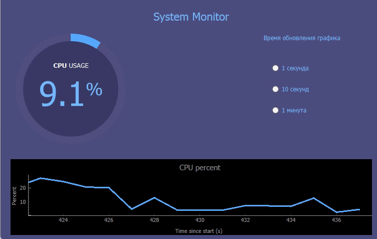
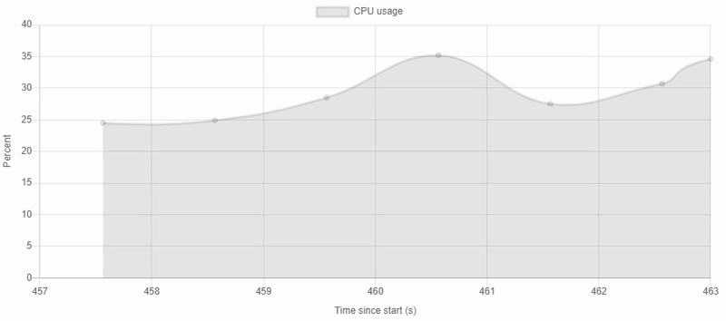
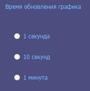

# CPU-load
🔥🔥 Проект представляет собой программу для Windows, измеряющее процент загрузки процессора компьютера и демонстрирующее это в виде графика в реальном масштабе времени. 
Реализована возможность настраивать время обновления графика (1 секунда, 10 секунд, 1 минута)

Проект реализован с использованием:

-PyQt

-Django

-Charts.js

-Redis

-Django Channels

-SQLite3

## Возможности
### Графики
С помощью графиков визуально демонстрируется процент загрузки процессора компьютера

Приложение отправляет данные на сервис и на веб-странице в реальном времени так же 
отображается график

### Настройка времени обновления графика
С помощью переключателей можно выбрать время обновления графика, это также повлияет на график 
удалённого сервиса

### Сохранение данных
Все полученные данные сохраняются в базу данных

